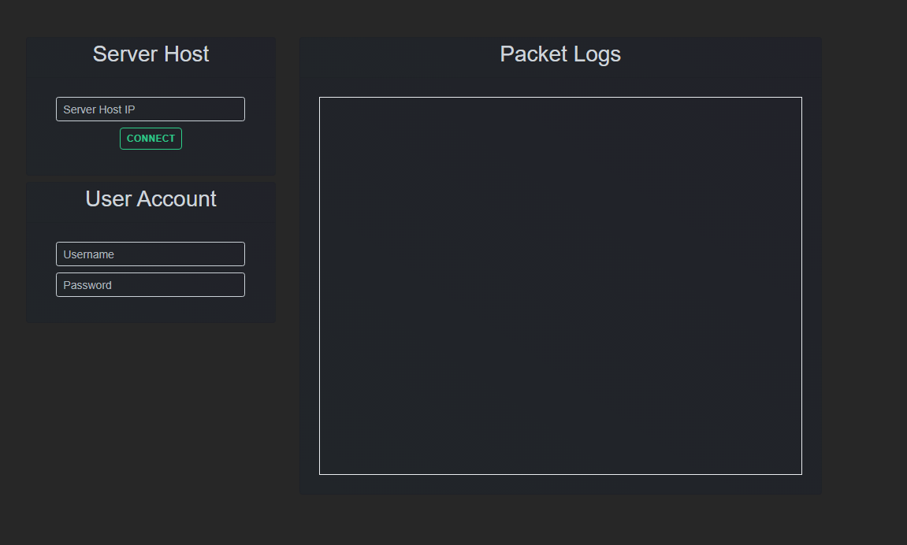
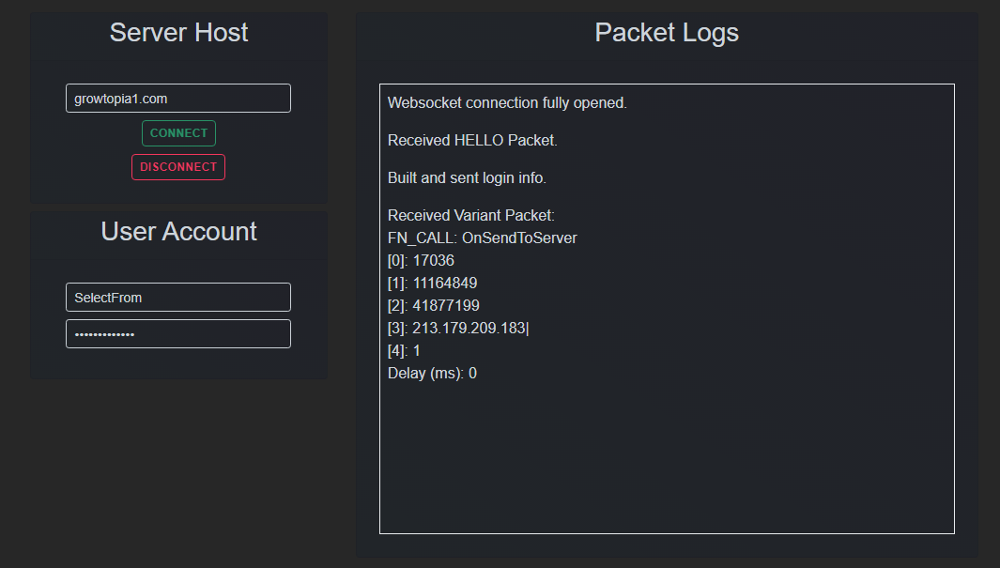
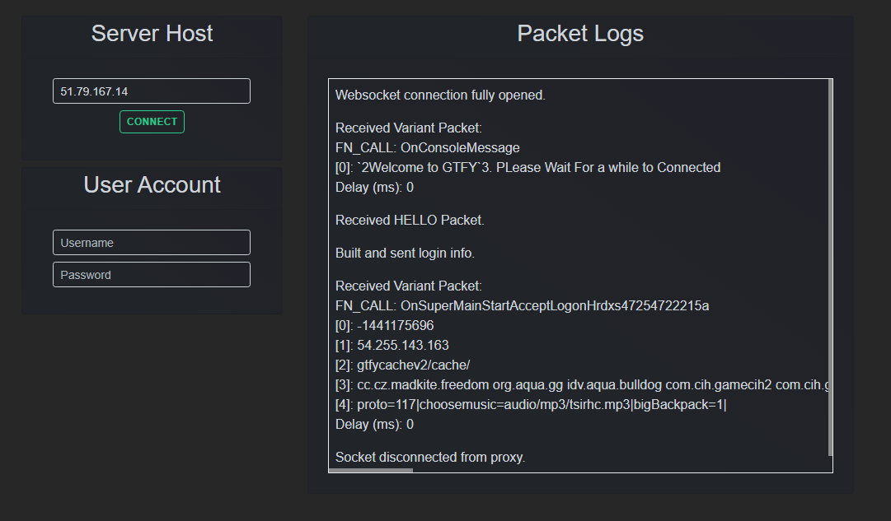

# GTBot
 A Web-based Growtopia Bot.

## Previews




## How it works
Basically, a NodeJS app is created, which acts as a ENet Client and also a Websocket server. It's a proxy to make communication from the website to ENet.  
It uses websockets to communicate to make it easier, and since js on web only supports tcp.

## Setup
Services used:
  - Proxy (/proxy)
  - Website (Optional, you can just connect via websockets instead of websites)
  - Cors (Required if website is used.)

Make sure you have the necessary tools installed, which are:
- For Windows:  
  - Windows Build Tools (`npm install --global windows-build-tools`)

- For Linux:
  - Build Tools (Install `build-essential`)

- Both:
  - Node GYP (`npm install --global node-gyp`)  
  - Python 2.7

Once all the necessary tools are installed, you can now install the packages by doing:
```
$ npm install
```  

Once the packages are installed, you should configure the config inside the `config.json` file.  
The `config` file contains the required data to make it work.  

`proxy` - The proxy object contains two child properties. `ws` which is an object, and `usingNewPacket`.  
  - The `ws` object contains only one field, which is the `port` property which will signify what port to use for the proxy server.  
  - The `usingNewPacket` property is set if the proxy will use the new packet protocol that Growtopia has.

`web` - The `web` object contains only one property, which is `wsServers`. Which is an array of websocket servers that it can connect to.  
-  Each object in the `wsServers` array has 3 properties, `host`, `port`.
   - The `host` property indicates what ip the websocket server is hosted at.
   - The `port` ip determines what port the websocket server is listening to.
   - The `usingNewPacket` indicated if the websocket uses the new packet protocol. This is optional and defaults to `false`.

`cors` - Next up is the `cors` object. This is pretty much a proxy for web requests to "bypass" the no-cross origin errors. This should only be set if you are using the website. It has 2 properties, `host` and `port`.
  - `host` would be the ip on which the cors proxy is hosted at.
  - The `port` determines on what port the cors proxy is listening to.

## Making it online
### Proxy
  To turn on the proxy, you must build the necessary native module first. By simply doing:  
  ```
  $ npm run buildProxy
  ```
  After that, just run the proxy by doing `npm run proxy`.

### Website
  The website uses Nextjs which is a framework over React. It makes server side rendering and routes much easier to handle. To run it there are two options, `dev` mode and `production` mode.  

  `dev` mode is for development purposes only. If you want to edit the site and see a live preview, `dev` mode would be the best for you. Otherwise, use `production` mode to use a fast version of the site that is production-ready.

  To run the `dev` mode version of the site, do:
  ```
  $ npm run siteDev
  ```
  
  While for the production mode, you would have to do these two simultaneously.
  ```
  $ npm run buildSite
  $ npm run site
  ```

  Both modes listens to port `:80` for the website.

### Cors
  The cors proxy is pretty much easy to run, you simply do:
  ```
  $ npm run cors
  ```
  and it should be online.

## TODO List:
  - [ ] Support subserver connections.
  - [ ] Fix connections to private servers.
  - [ ] World Joining
  - [ ] ???

## Support
You can join the [Pogtopia Development Discord](https://discord.gg/vap8XBhhvz) and ask in the `#coding` channel for support about this project. 

## Credits
[ama](https://github.com/ama6nen) - Contains the modified ENet Library to work with the gt server. And string types of packet types.